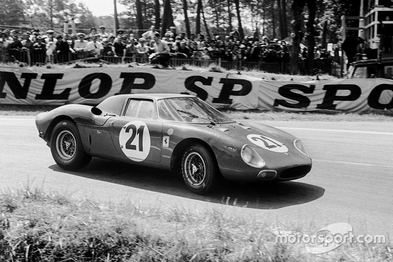

# Competencias de Ferrari 

.jpeg)

En todos los años en los que ferrari estuvo en el mundo automovilistico, este participo en muchas carreras y competencias. Con la Escuderia Ferrari, que empezo en 1920, para luego ser parte de Alpha Romeo. Pero, luego de 1940 se separo y por no poder competir por un tiempo empezo a hacer Autos de carrera.

El equipo de Ferrari empezo a competir despues de la segunda guerra mundial, y corrio carreras y competencias como:

- Formula 1 
- Gran Premio Europeo 
- 24 horas de Daytona
- Carrera Panamericana 
- Campeonato Mundial de Resistencia
- 24 Horas de Lemans 
- Mille Miglia 
- Giro de sicilia

[Enlace](https://es.wikipedia.org/wiki/Ferrari)
## Campeonato Mundial de Resistencia
fue la serie mundial de carreras de autos deportivos realizada por la [FIA](https://es.wikipedia.org/wiki/Federación_Internacional_del_Automóvil) desde 1953 hasta 1992.

 Esta competencia era una serie de carreras legendarias que ya se hacian desde antes, y que junto a la formula 1 fue la competencia automovilistica mas importante. Y que muchas empresas gastaban millones de dolares para tener el privilegio de participar y ganar esta increible competencia.
-  Mille Miglia
- la Carrera Panamericana 
- la Targa Florio
-  24 Horas de Le Mans
- las 12 Horas de Sebring
- el Tourist Trophy 
- los 1000 km de Nürburgring.
- 

## Cuantas veces gano ferrari 
+ Ferrari a ganado 10 lemans a lo largo de su historia
+ 15 [titulos constructores](https://es.wikipedia.org/wiki/Campeonato_Mundial_de_Sport_Prototipos) 
+ 7 Victorias en Mille Miglia
+ 7 Victorias en Targa Florio 

## Formula 1 

La competencia mas prestigiosa del mundo automobilistico, [el mundial de automovilismo](https://es.wikipedia.org/wiki/Fórmula_1), Y este tiene su historia desde 1950, en la que ferrari participo, Participando en toda su historia

Ferrari gano un total de [244 victorias](https://www.caranddriver.com/es/formula-1/equipos/a3478/ferrari/)

