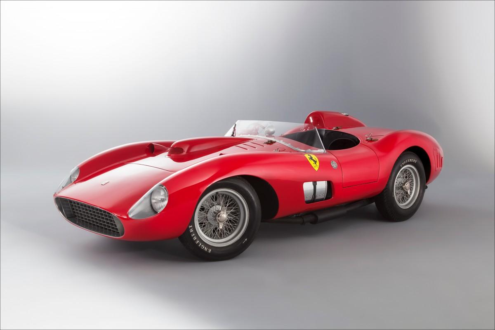
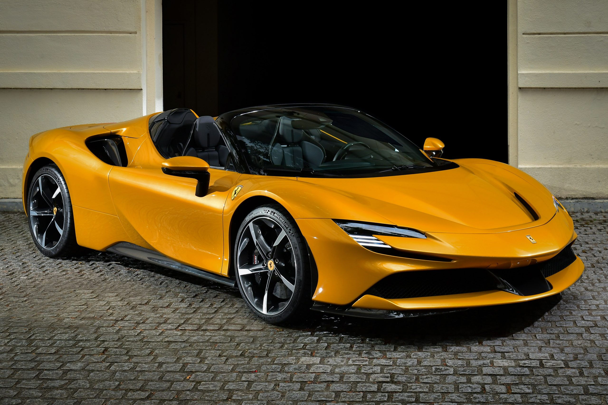

# Modelos de ferrari mas conocidos
+ 1962 Ferrari 250 GTO 
+ 1987 Ferrari F40

# Modelos de ferraris mas caros
+ Ferrari 335 S
+ Ferarri 290 MM

# Modelos de ferrari mas baratos
+ Ferrari Mondial 8
+ Ferrari 400i Automático

# modelos de ferrari mas nuevos
+ SF90 spider
+ 296 GTB

##  PARA MAS INFORMACION 
+ [PAGINA OFICIAL DE FERRARI](https://r.search.yahoo.com/_ylt=Awril2YFokdm2wALsaWr9Qt.;_ylu=Y29sbwNiZjEEcG9zAzEEdnRpZAMEc2VjA3Ny/RV=2/RE=1715999366/RO=10/RU=https%3a%2f%2fwww.ferrari.com%2fes-ES/RK=2/RS=nEd.Mz5PNz4ZUQJ4z_DnvEz7mTU-)
    
+ [PRINCIPALES COMPETIDORES DE FERRARI](https://r.search.yahoo.com/_ylt=AwrNZGiKokdmbsUKat.r9Qt.;_ylu=Y29sbwNiZjEEcG9zAzEEdnRpZAMEc2VjA3Ny/RV=2/RE=1715999498/RO=10/RU=https%3a%2f%2fferrariclubarg.com.ar%2fferrari-competitors%2f/RK=2/RS=cokqUv9yfFWfz4CPID4Hjxw7PIw-)

+ [CONCECIONARIO](https://r.search.yahoo.com/_ylt=AwrNZnbAokdmLz4LBUer9Qt.;_ylu=Y29sbwNiZjEEcG9zAzEEdnRpZAMEc2VjA3Ny/RV=2/RE=1715999552/RO=10/RU=https%3a%2f%2fwww.ferrari.com%2fes-ES%2fauto%2fconcesionarios/RK=2/RS=wkIVMWmlDs5c7Y0tspl6NEEcRbU-)

+ [DISTINTAS GAMAS](https://r.search.yahoo.com/_ylt=AwrNP3wApEdmjcULtRCr9Qt.;_ylu=Y29sbwNiZjEEcG9zAzEEdnRpZAMEc2VjA3Ny/RV=2/RE=1715999872/RO=10/RU=https%3a%2f%2fwww.ferrari.com%2fes-ES%2fauto%2fgama/RK=2/RS=8yDsTvbaGUUg4mGWBSBEKt_9l6k-)

+ [VENTAJAS Y DESVENTAJAS DE COMPRAR UN FERRARI](https://r.search.yahoo.com/_ylt=AwrNacJPpEdmP2wLHiWr9Qt.;_ylu=Y29sbwNiZjEEcG9zAzEEdnRpZAMEc2VjA3Ny/RV=2/RE=1715999951/RO=10/RU=https%3a%2f%2ftopdriverz.com%2fcoches-actuales%2fventajas-desventajas-comprarse-ferrari/RK=2/RS=WBmQ7jhBrFaYwDr9FvzeSwMMaDA-)

    

