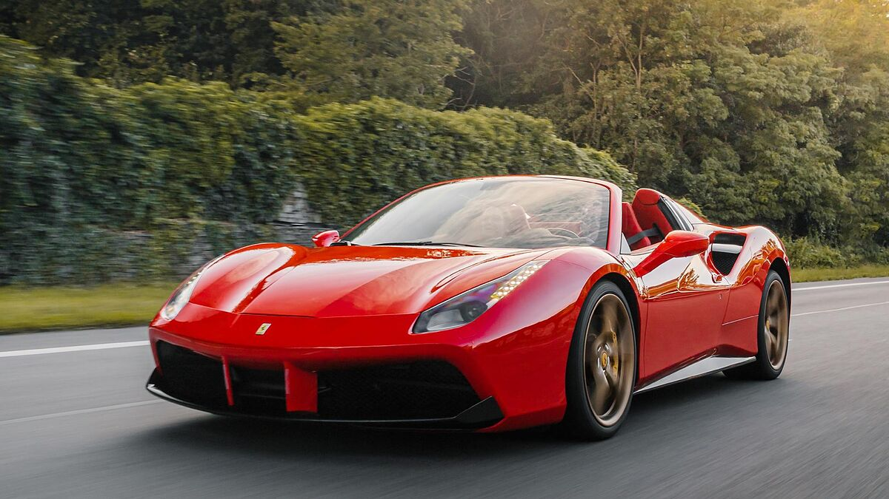
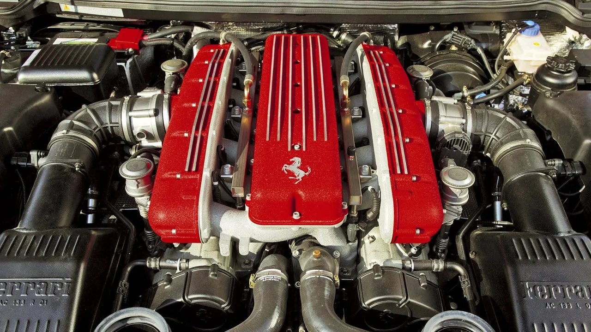
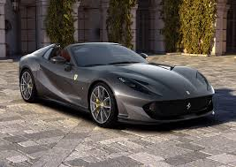
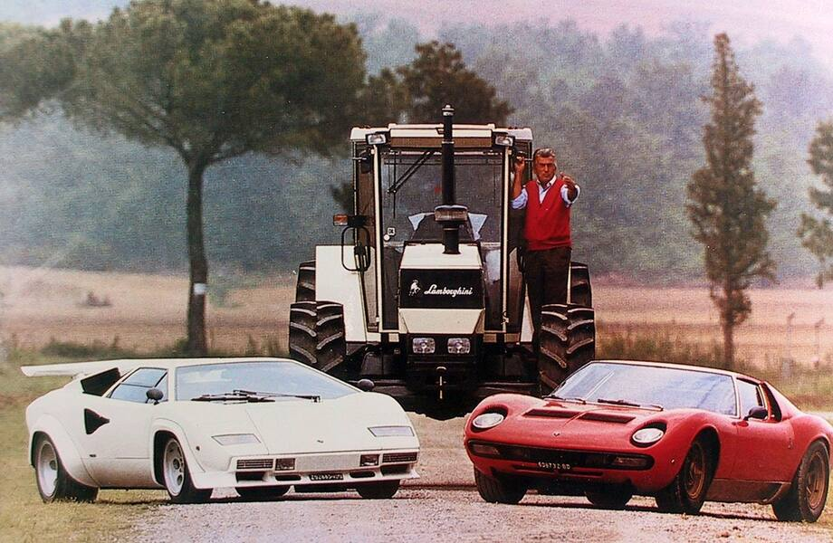

[Nuestra pagina](https://www.ferrari.com/es-ES/magazine/articles/cutting-edge-corners-purosangue-active-suspension-technology)

[Equipo competitivo](https://www.formula1.com/en/teams/ferrari)

[Abu dabi](https://www.ferrariworldabudhabi.com/) 

[mas sobre nosotros](https://soymotor.com/f1/equipos/ferrari)

# Componentes de autos de ferrari

+  La restricción de 100 kg/h de consumo de combustible no permite aumentar la velocidad de rotación para las 15 mil revoluciones por minuto, obligando a que los técnicos se concentren en la búsqueda de una mayor presión de sobrealimentación del turbo y dentro de la cámara de combustión, (hay quienes esperan se superé los 5 bar) generando más potencia, teniendo como un objetivo alcanzar los 300 bar.
+ Gracias al exclusivo diseño de Giorgio Piola nos puede mostrar lo que han sido las intervenciones realizadas en la unidad de potencia en comparación con el año pasado. Esta es una verdadera revolución gracias a un meticuloso trabajo pieza por pieza. Estos días son para el montaje de la unidad de alimentación 2016, que será utilizado en el test de Barcelona de Ferrari y Haas, mientras qué Sauber y Toro Rosso correrán con versiones 2015.

# Que lo diferencia de las demas marcas de lujo?
Es un hecho que esta compania tiene una historica rivalidad con la famosa Lamborghini y la cuestion de cual es mejor es el foco de varias conversaciones. Ninguna de las dos es considerada subjetivamente superior y cada aficionado por los automoviles tiene su razon de opinar. Pero, que diferencias tecnicas tienen?
+ ### Motor
Respecto a este punto, ambas equipan sus coches deportivos con motores potentes y avanzados. Los motores de Lamborghini tienden a ser más grandes y potentes que los de Ferrari, como el V12 de 6.5 litros del Aventador, en comparación con el V8 de 3.9 litros del Ferrari 488 GTB.

Sin embargo, hablando de Ferrari, esta ha logrado un rendimiento impresionante gracias a su tecnología avanzada, como la turboalimentación y la hibridación, como en el caso del Ferrari SF90 Stradale que cuenta con más de 1000 CV.
+ ### Interiores
Tanto Lamborghini como Ferrari ofrecen diseños de interiores personalizables y de alta calidad, utilizando materiales premium como cuero y fibra de carbono. Lamborghini se destaca por ofrecer una amplia variedad de opciones de cuero y alcántara de alta calidad, así como detalles en fibra de carbono y otros materiales premium. 

Ferrari también ofrece una extensa variedad de opciones de personalización para el diseño interior y exterior, con acabados en cuero de alta calidad y detalles en fibra de carbono.
Ambas marcas también cuentan con tecnología de última generación en sus interiores, incluyendo sistemas de infoentretenimiento avanzados, pantallas táctiles y sistemas de audio de alta calidad. Cada marca tiene su propio estilo distintivo en cuanto al diseño y disposición de los elementos del interior, pero ambos garantizan una experiencia de conducción lujosa y de alta calidad.
+ ### Consumo
Los coches de Lamborghini y Ferrari tienen diferentes niveles de consumo de combustible. Los modelos de Lamborghini generalmente tienen un consumo de combustible ligeramente más alto que los modelos de Ferrari. Esto se debe principalmente a la mayor potencia del motor Lamborghini. Por ejemplo, un Lamborghini Aventador tiene un consumo de combustible promedio de 13.2 litros por 100 kilómetros, mientras que un Ferrari 488 tiene un consumo de combustible promedio de 11.9 litros por 100 kilómetros. Esto significa que un Lamborghini consume un 8% más de combustible que un Ferrari.
+ ### Dimensiones
Para esto, seleccionamos dos de los mejores coches de ambas marcas. El Lamborghini Aventador mide 4.8 metros de largo, 2.0 metros de ancho y 1.1 metros de alto, mientras que el Ferrari 488 GTB mide 4.6 metros de largo, 1.9 metros de ancho y 1.2 metros de alto.

Sin embargo, las dimensiones no determinan la calidad o el rendimiento del coche, ya que los vehículos de ambas marcas se enfocan en ofrecer la mejor experiencia de conducción.
#  La Potencia y la Innovación [review](https://www.caranddriver.com/ferrari)
- La potencia de Ferrari se reparte entre el motor de gasolina V12 de 7.0 litros que genera 860 caballos de fuerza y el motor eléctrico que da 190 caballos de fuerza. Pero si hablamos a nivel general, el California T tiene 560, el 458 Italia tiene 570 y el 488 Spider tiene 670.

# Tecnología de Suspensión en Ferrari

En lo tocante al confort de marcha, también se ha realizado una enorme cantidad de trabajo. «La tecnología activa se instala en la rueda, por lo que hay que gestionar la masa extra», explica Francesca. «Utilizar el módulo de control del motor para lograr el nivel adecuado de comodidad ha sido todo un desafío». El sistema funciona automáticamente, aunque el conductor puede elegir uno de los tres niveles de amortiguación diferentes con un manettino especial. 

La capacidad del Purosangue para hacer frente a carreteras difíciles supone un punto de partida completamente nuevo para Ferrari. Se realizaron muchas pruebas de durabilidad en superficies pavimentadas irregulares. Alfredo recuerda en particular un experimento que realizó el equipo: «Pusimos unos vasos de plástico en el techo y el control del movimiento de la carrocería de la suspensión activa los mantuvo estables. Al apagar el sistema, los vasos ya no se quedaban en el techo». 

Hubo muchos problemas de desarrollo. El motor electrónico se desarrolló enteramente desde cero e hizo falta un gran esfuerzo para diseñar una unidad compacta capaz de sostener fuerzas de hasta 6000 newtons por ángulo. El sofisticado sistema tiene su propia batería e incluso su propia refrigeración, y utiliza dos bombas (una por eje) alimentadas por un pequeño radiador. 

